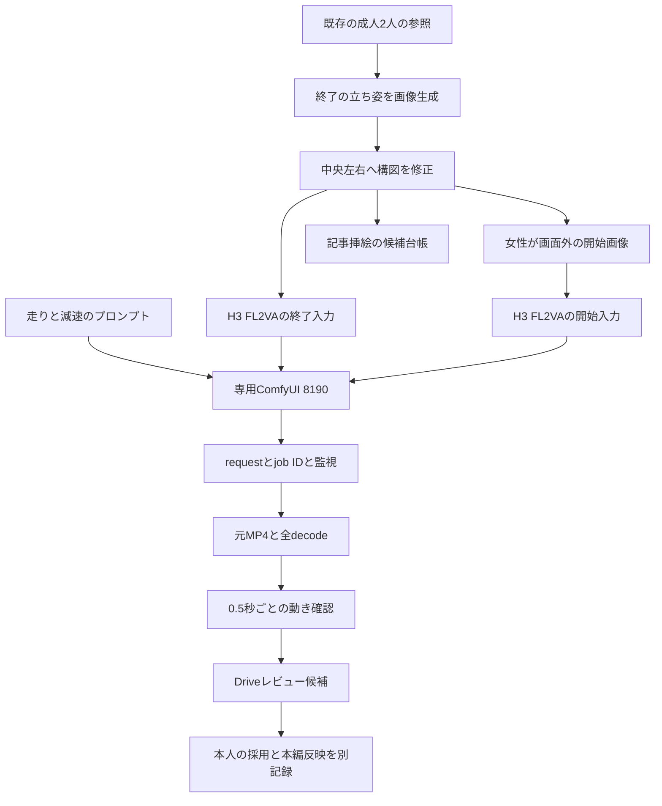

# 待ち合わせカットの構成図

```mermaid
flowchart TD
    A[既存の成人2人の参照] --> B[終了の立ち姿を画像生成]
    B --> C[中央左右へ構図を修正]
    C --> D[女性が画面外の開始画像]
    C --> E[H3 FL2VAの終了入力]
    D --> F[H3 FL2VAの開始入力]
    P[走りと減速のプロンプト] --> G[専用ComfyUI 8190]
    E --> G
    F --> G
    G --> H[requestとjob IDと監視]
    H --> I[元MP4と全decode]
    I --> J[0.5秒ごとの動き確認]
    J --> K[Driveレビュー候補]
    C --> L[記事挿絵の候補台帳]
    K --> M[本人の採用と本編反映を別記録]
```
