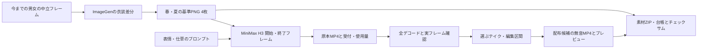

# 春服と夏服｜アーキテクチャ図

```mermaid
flowchart LR
    Base["今までの男女の中立フレーム"] --> Clothes["ImageGenの衣装差分"]
    Clothes --> Stills["春・夏の基準PNG 4枚"]
    Stills --> Motion["MiniMax H3 開始・終了フレーム"]
    Prompts["表情・仕草のプロンプト"] --> Motion
    Motion --> Raw["原本MP4と受付・使用量"]
    Raw --> Review["全デコードと実フレーム確認"]
    Review --> Selection["選ぶテイク・編集区間"]
    Selection --> Export["配布候補の無音MP4とプレビュー"]
    Stills --> Package["素材ZIP・台帳とチェックサム"]
    Export --> Package
```
