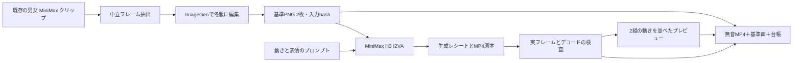

# 男女キャラクター冬服｜アーキテクチャ図

```mermaid
flowchart LR
    Previous["既存の男女 MiniMax クリップ"] --> Still["中立フレーム抽出"]
    Still --> Edit["ImageGenで冬服に編集"]
    Edit --> Base["基準PNG 2枚・入力hash"]
    Base --> Animate["MiniMax H3 I2VA"]
    Prompt["動きと表情のプロンプト"] --> Animate
    Animate --> Raw["生成レシートとMP4原本"]
    Raw --> Check["実フレームとデコードの検査"]
    Check --> Pack["無音MP4＋基準画＋台帳"]
    Base --> Pack
    Check --> Reel["2組の動きを並べたプレビュー"]
    Reel --> Pack
```
