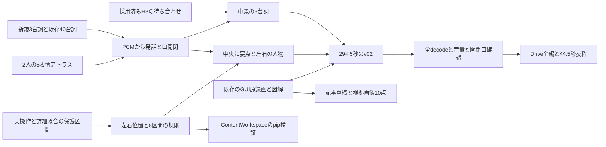
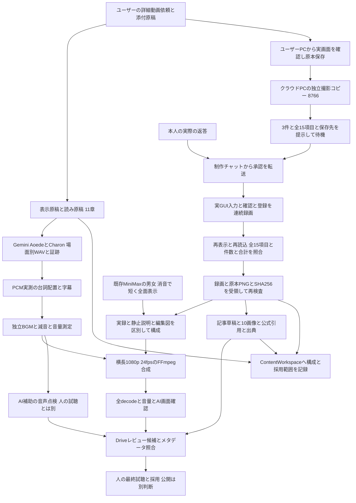

# dots転記 詳細動画の構成図

## v02：会話と規則付きPIP

```mermaid
flowchart LR
    A[採用済みH3の待ち合わせ] --> C[中景の3台詞]
    B[新規3台詞と既存40台詞] --> Gate[PCMから発話と口開閉]
    Art[2人の5表情アトラス] --> Gate
    Gate --> C
    Rule[左右位置と8区間の規則] --> PIP[中央に要点と左右の人物]
    Gate --> PIP
    Protected[実操作と詳細照合の保護区間] --> Rule
    C --> Edit[294.5秒のv02]
    PIP --> Edit
    Demo[既存のGUI原録画と図解] --> Edit
    Edit --> QA[全decodeと音量と開閉口確認]
    QA --> Review[Drive全編と44.5秒抜粋]
    Rule --> Workspace[ContentWorkspaceのpip検証]
    Demo --> Blog[記事草稿と根拠画像10点]
```

口形は音声強度に反応する簡易方式。音素ごとの同期、人の試聴、本人採用、公開を技術検証から推定しない。

```mermaid
flowchart TD
    U[ユーザーの詳細動画依頼と添付原稿] --> P[表示原稿と読み原稿 11章]
    U --> C[ユーザーPCから実画面を確認し原本保存]
    C --> D[クラウドPCの独立撮影コピー 8766]
    D --> W[3件と全15項目と保存先を提示して待機]
    H[本人の実際の返答] --> A[制作チャットから承認を転送]
    W --> A
    A --> G[実GUI入力と確認と登録を連続録画]
    G --> V[再表示と再読込 全15項目と件数と合計を照合]
    V --> Z[録画と原本PNGとSHA256を受領して再検査]
    P --> T[Gemini AoedeとCharon 場面別WAVと証跡]
    T --> L[PCM実測の台詞配置と字幕]
    L --> M[独立BGMと減音と音量測定]
    Z --> E[実録と静止説明と編集図を区別して構成]
    K[既存MiniMaxの男女 消音で短く全面表示] --> E
    E --> R[横長1080p 24fpsのFFmpeg合成]
    M --> R
    R --> Q[全decodeと音量とAI画面確認]
    M --> Q2[AI補助の音声点検 人の試聴とは別]
    Q --> DRIVE[Driveレビュー候補とメタデータ照合]
    Q2 --> DRIVE
    Z --> B[記事草稿と10画像と公式引用と出典]
    B --> DRIVE
    P --> DB[ContentWorkspaceへ構成と採用範囲を記録]
    B --> DB
    Z --> DB
    DRIVE --> REVIEW[人の最終試聴と採用 公開は別判断]
```

拒否・結果不明は自動再送しない。旧版と新規の実録、本人承認と演出、技術検証と人の採用を混同しない。
