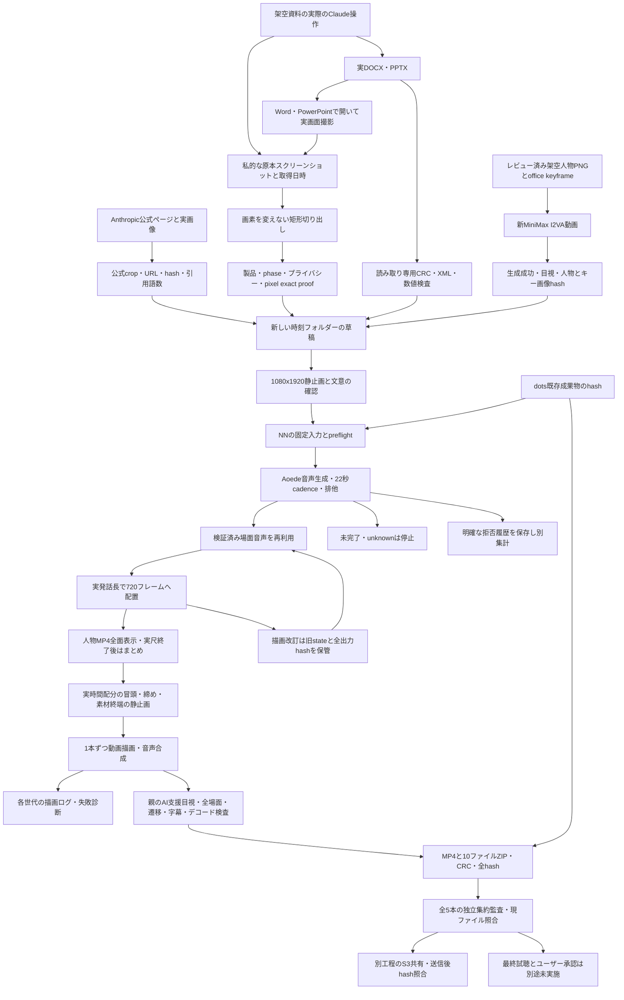

# Claude 資料作成シリーズの処理図

```mermaid
flowchart TD
  Official[Anthropic公式ページと実画像] --> OfficialProof[公式crop・URL・hash・引用語数]
  Claude[架空資料の実際のClaude操作] --> Raw[私的な原本スクリーンショットと取得日時]
  Claude --> Files[実DOCX・PPTX]
  Raw --> Crop[画素を変えない矩形切り出し]
  Crop --> DemoProof[製品・phase・プライバシー・pixel exact proof]
  Files --> Xml[読み取り専用CRC・XML・数値検査]
  Files --> Apps[Word・PowerPointで開いて実画面撮影]
  Apps --> Raw
  PNG[レビュー済み架空人物PNGとoffice keyframe] --> MiniMax[新MiniMax I2VA動画]
  MiniMax --> VideoProof[生成成功・目視・人物とキー画像hash]
  OfficialProof --> Draft[新しい時刻フォルダーの草稿]
  DemoProof --> Draft
  Xml --> Draft
  VideoProof --> Draft
  Draft --> Still[1080x1920静止画と文意の確認]
  Still --> Freeze[NNの固定入力とpreflight]
  Freeze --> Speech[Aoede音声生成・22秒cadence・排他]
  Speech --> Cache[検証済み場面音声を再利用]
  Speech --> Stop[未完了・unknownは停止]
  Speech --> Rejected[明確な拒否履歴を保存し別集計]
  Cache --> Prepare[実発話長で720フレームへ配置]
  Prepare --> Character[人物MP4全面表示・実尺終了後はまとめ]
  Character --> PreparedStill[実時間配分の冒頭・締め・素材終端の静止画]
  PreparedStill --> Render[1本ずつ動画描画・音声合成]
  Render --> Log[各世代の描画ログ・失敗診断]
  Prepare --> Revision[描画改訂は旧stateと全出力hashを保管]
  Revision --> Cache
  Render --> Review[親のAI支援目視・全場面・遷移・字幕・デコード検査]
  Review --> Package[MP4と10ファイルZIP・CRC・全hash]
  Package --> Audit[全5本の独立集約監査・現ファイル照合]
  Audit --> Share[別工程のS3共有・送信後hash照合]
  Audit --> Pending[最終試聴とユーザー承認は別途未実施]
  Old[dots既存成果物のhash] --> Freeze
  Old --> Package
```

`_private`の原本やAPIキーは公開ZIPへ流しません。静止画検査は仮のタイミングであり、実音声同期やユーザー承認とは分けます。YouTubeへの投稿処理はありません。
