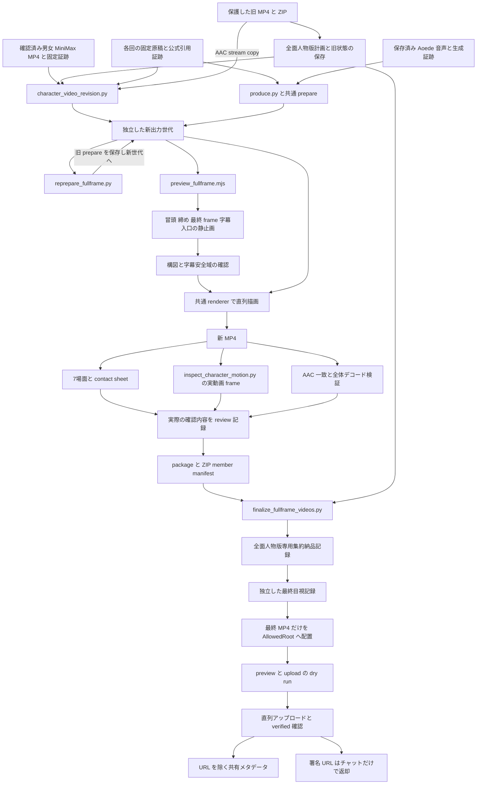

# dots 第5回から第9回のアーキテクチャ図

```mermaid
flowchart TD
    Stories[各回の固定原稿と公式引用証跡] --> Prepare[produce.py と共通 prepare]
    Speech[保存済み Aoede 音声と生成証跡] --> Prepare
    Old[保護した旧 MP4 と ZIP] --> Plan[全面人物版計画と旧状態の保存]
    Clips[確認済み男女 MiniMax MP4 と固定証跡] --> Character[character_video_revision.py]
    Plan --> Character
    Stories --> Character
    Old -->|AAC stream copy| Character
    Character --> Prepared[独立した新出力世代]
    Prepare --> Prepared
    Prepared --> Refresh[reprepare_fullframe.py]
    Refresh -->|旧 prepare を保存し新世代へ| Prepared
    Prepared --> Still[preview_fullframe.mjs]
    Still --> Layout[冒頭 締め 最終 frame 字幕入口の静止画]
    Layout --> LayoutReview[構図と字幕安全域の確認]
    LayoutReview --> Serial[共通 renderer で直列描画]
    Prepared --> Serial
    Serial --> Movie[新 MP4]
    Movie --> Scenes[7場面と contact sheet]
    Movie --> Motion[inspect_character_motion.py の実動画 frame]
    Movie --> Audio[AAC 一致と全体デコード検証]
    Scenes --> Review[実際の確認内容を review 記録]
    Motion --> Review
    Audio --> Review
    Review --> Package[package と ZIP member manifest]
    Package --> Final[finalize_fullframe_videos.py]
    Plan --> Final
    Final --> Delivery[全面人物版専用集約納品記録]
    Delivery --> RootReview[独立した最終目視記録]
    RootReview --> Stage[最終 MP4 だけを AllowedRoot へ配置]
    Stage --> DryRun[preview と upload の dry run]
    DryRun --> S3[直列アップロードと verified 確認]
    S3 --> Receipts[URL を除く共有メタデータ]
    S3 --> Links[署名 URL はチャットだけで返却]
```

原稿・音声・人物素材は固定入力として照合する。旧版の出力と共有記録は新しい全面人物版で上書きしない。静止画確認、完成MP4の動作確認、技術検証、ユーザー承認は別の状態として扱う。
