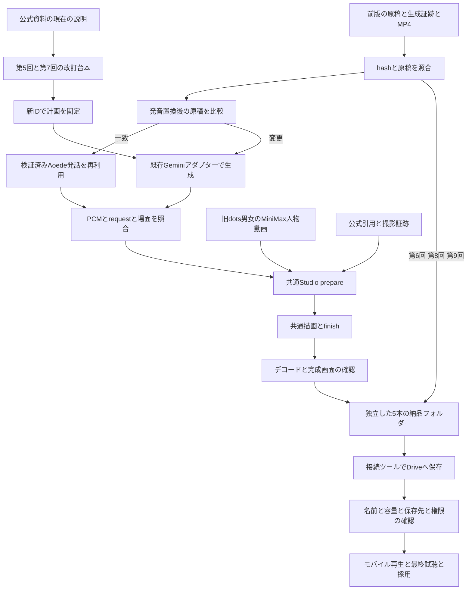

# dots 第5〜9回の最終改訂フロー

```mermaid
flowchart TD
    Official[公式資料の現在の説明] --> Scripts[第5回と第7回の改訂台本]
    Previous[前版の原稿と生成証跡とMP4] --> Verify[hashと原稿を照合]
    Scripts --> Freeze[新IDで計画を固定]
    Verify --> Match[発音置換後の原稿を比較]
    Match -->|一致| Reuse[検証済みAoede発話を再利用]
    Match -->|変更| Gemini[既存Geminiアダプターで生成]
    Freeze --> Gemini
    Gemini --> PCM[PCMとrequestと場面を照合]
    Reuse --> PCM
    PCM --> Prepare[共通Studio prepare]
    Characters[旧dots男女のMiniMax人物動画] --> Prepare
    Quotes[公式引用と撮影証跡] --> Prepare
    Prepare --> Render[共通描画とfinish]
    Render --> Review[デコードと完成画面の確認]
    Verify -->|第6回 第8回 第9回| Collection[独立した5本の納品フォルダー]
    Review --> Collection
    Collection --> Drive[接続ツールでDriveへ保存]
    Drive --> Readback[名前と容量と保存先と権限の確認]
    Readback --> Human[モバイル再生と最終試聴と採用]
```

原稿中の定期実行例は説明素材であり、実際のscheduleを登録する経路はない。旧作は保存したまま新しい台本・音声・描画世代を追加する。
