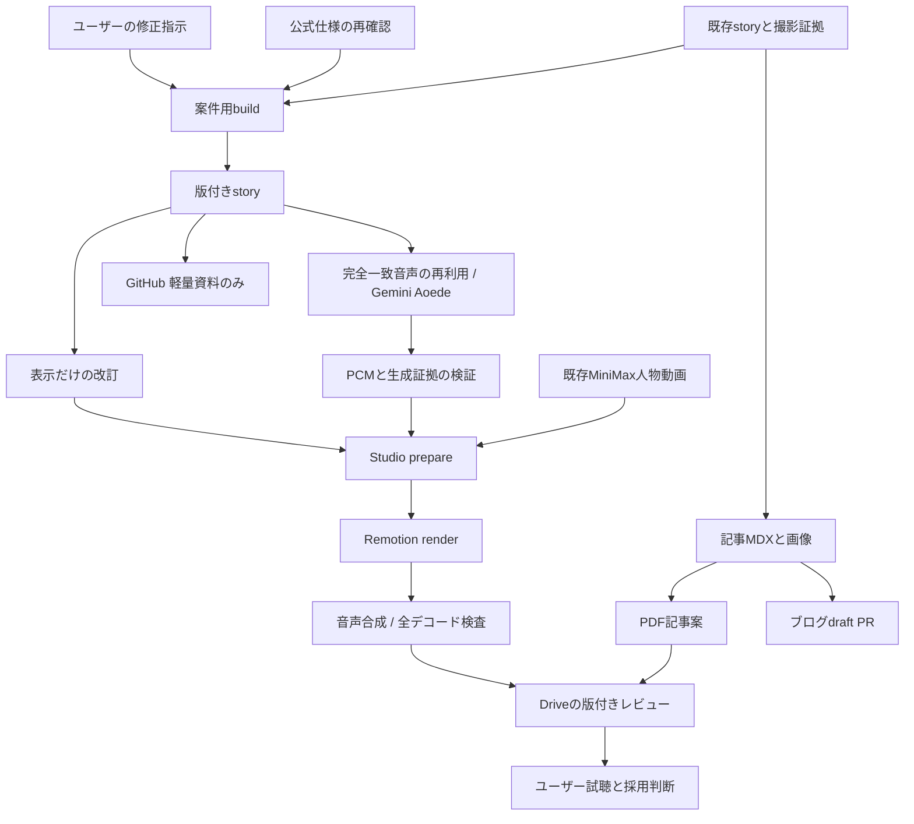

# 編集改訂の構成図

```mermaid
flowchart TD
    Review[ユーザーの修正指示] --> Build[案件用build]
    Official[公式仕様の再確認] --> Build
    Saved[既存storyと撮影証拠] --> Build
    Build --> Story[版付きstory]
    Story --> Audio[完全一致音声の再利用 / Gemini Aoede]
    Audio --> Proof[PCMと生成証拠の検証]
    Story --> Visual[表示だけの改訂]
    Visual --> Prepare[Studio prepare]
    Proof --> Prepare
    Motion[既存MiniMax人物動画] --> Prepare
    Prepare --> Render[Remotion render]
    Render --> Finish[音声合成 / 全デコード検査]
    Saved --> Blog[記事MDXと画像]
    Blog --> PDF[PDF記事案]
    Finish --> Drive[Driveの版付きレビュー]
    PDF --> Drive
    Drive --> User[ユーザー試聴と採用判断]
    Story --> Git[GitHub 軽量資料のみ]
    Blog --> PR[ブログdraft PR]
```
