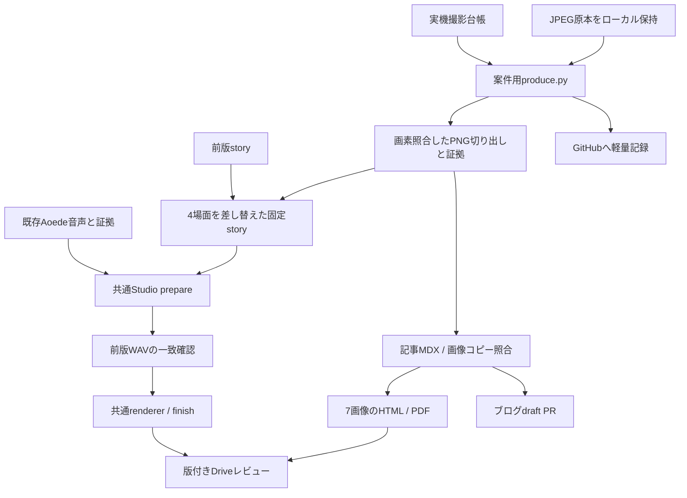

# 実画面差し替えの構成図

```mermaid
flowchart TD
  Manifest[実機撮影台帳] --> Adapter[案件用produce.py]
  Original[JPEG原本をローカル保持] --> Adapter
  Adapter --> Crop[画素照合したPNG切り出しと証拠]
  Prior[前版story] --> Story[4場面を差し替えた固定story]
  Crop --> Story
  Voice[既存Aoede音声と証拠] --> Prepare[共通Studio prepare]
  Story --> Prepare
  Prepare --> Match[前版WAVの一致確認]
  Match --> Render[共通renderer / finish]
  Crop --> Article[記事MDX / 画像コピー照合]
  Article --> PDF[7画像のHTML / PDF]
  Render --> Drive[版付きDriveレビュー]
  PDF --> Drive
  Article --> Blog[ブログdraft PR]
  Adapter --> Git[GitHubへ軽量記録]
```
