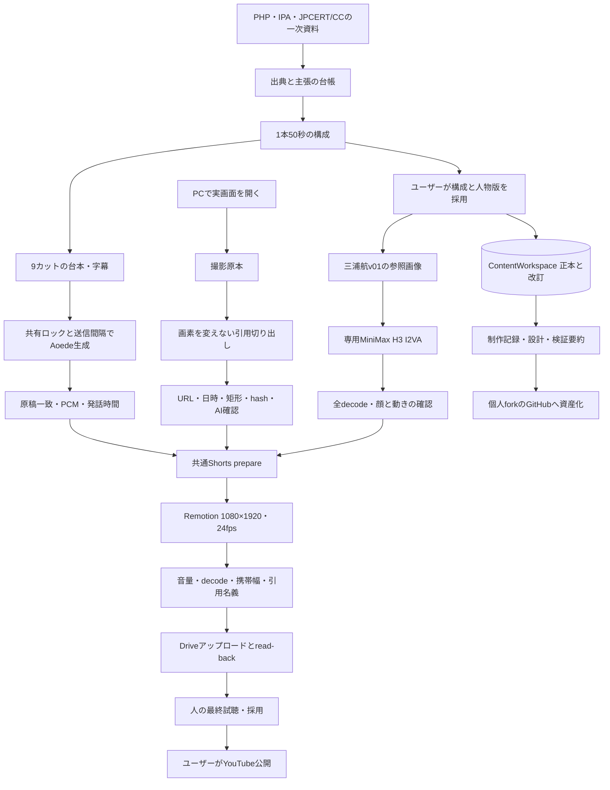
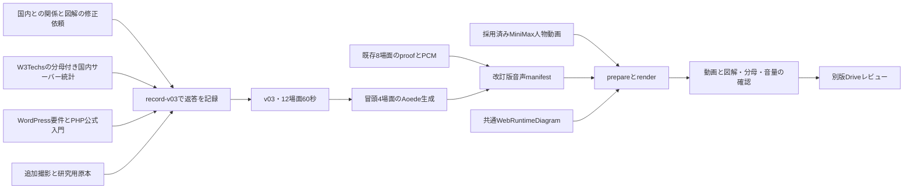
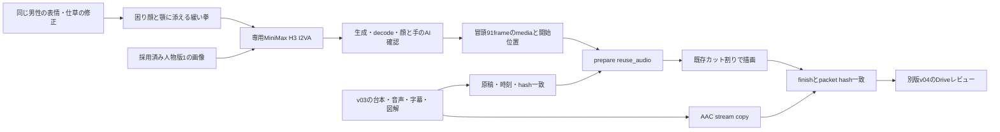

# PHP2Shell制作フロー

```mermaid
flowchart TD
  Source[PHP・IPA・JPCERT/CCの一次資料] --> Research[出典と主張の台帳]
  PC[PCで実画面を開く] --> Raw[撮影原本]
  Raw --> Crop[画素を変えない引用切り出し]
  Crop --> Proof[URL・日時・矩形・hash・AI確認]
  Research --> Plan[1本50秒の構成]
  Plan --> Approval[ユーザーが構成と人物版を採用]
  Approval --> Workspace[(ContentWorkspace 正本と改訂)]
  Approval --> Image[三浦航v01の参照画像]
  Image --> H3[専用MiniMax H3 I2VA]
  H3 --> MotionQC[全decode・顔と動きの確認]
  Plan --> Story[9カットの台本・字幕]
  Story --> TTS[共有ロックと送信間隔でAoede生成]
  TTS --> PCM[原稿一致・PCM・発話時間]
  PCM --> Prepare[共通Shorts prepare]
  Proof --> Prepare
  MotionQC --> Prepare
  Prepare --> Render[Remotion 1080×1920・24fps]
  Render --> QC[音量・decode・携帯幅・引用名義]
  QC --> Drive[Driveアップロードとread-back]
  Drive --> Human[人の最終試聴・採用]
  Human --> Publish[ユーザーがYouTube公開]
  Workspace --> Docs[制作記録・設計・検証要約]
  Docs --> Fork[個人forkのGitHubへ資産化]
```

Driveでの保存確認は、モバイル実機で再生できたことの証明と分ける。GitHubへの矢印には動画・音声・納品ZIPを含めない。

## v03の改訂依存

```mermaid
flowchart LR
  User[国内との関係と図解の修正依頼] --> Record[record-v03で返答を記録]
  Stats[W3Techsの分母付き国内サーバー統計] --> Record
  WP[WordPress要件とPHP公式入門] --> Record
  PC[追加撮影と研究用原本] --> Record
  Record --> Story[v03・12場面60秒]
  Story --> New[冒頭4場面のAoede生成]
  Old[既存8場面のproofとPCM] --> Voice[改訂版音声manifest]
  New --> Voice
  Motion[採用済みMiniMax人物動画] --> Edit[prepareとrender]
  Voice --> Edit
  Diagram[共通WebRuntimeDiagram] --> Edit
  Edit --> QC[動画と図解・分母・音量の確認]
  QC --> Review[別版Driveレビュー]
```

## v04の人物差し替え

```mermaid
flowchart LR
  User[同じ男性の表情・仕草の修正] --> Prompt[困り顔と顎に添える緩い拳]
  Ref[採用済み人物版1の画像] --> H3[専用MiniMax H3 I2VA]
  Prompt --> H3
  H3 --> Visual[生成・decode・顔と手のAI確認]
  Visual --> Intro[冒頭91frameのmediaと開始位置]
  Old[v03の台本・音声・字幕・図解] --> Match[原稿・時刻・hash一致]
  Match --> Edit[prepare reuse_audio]
  Intro --> Edit
  Edit --> Render[既存カット割りで描画]
  Old --> AAC[AAC stream copy]
  Render --> Finish[finishとpacket hash一致]
  AAC --> Finish
  Finish --> Review[別版v04のDriveレビュー]
```
