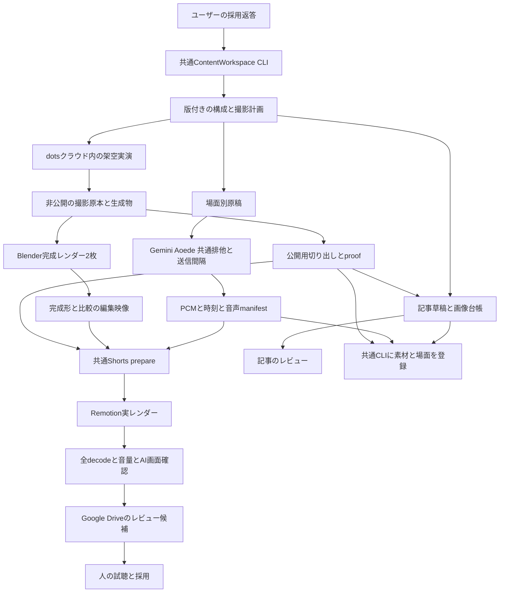

# dots短編試作の制作構成図

```mermaid
flowchart TD
    U[ユーザーの採用返答] --> C[共通ContentWorkspace CLI]
    C --> P[版付きの構成と撮影計画]
    P --> D[dotsクラウド内の架空実演]
    D --> R[非公開の撮影原本と生成物]
    R --> A[公開用切り出しとproof]
    R --> I[Blender完成レンダー2枚]
    I --> K[完成形と比較の編集映像]
    P --> S[場面別原稿]
    S --> V[Gemini Aoede 共通排他と送信間隔]
    V --> M[PCMと時刻と音声manifest]
    A --> Q[共通Shorts prepare]
    K --> Q
    M --> Q
    Q --> E[Remotion実レンダー]
    E --> T[全decodeと音量とAI画面確認]
    T --> G[Google Driveのレビュー候補]
    A --> B[記事草稿と画像台帳]
    P --> B
    G --> H[人の試聴と採用]
    B --> J[記事のレビュー]
    A --> W[共通CLIに素材と場面を登録]
    M --> W
    B --> W
```

技術検査・人の試聴・ユーザー採用・公開は別状態。クラウド実演とローカル編集の成功を混同しない。
