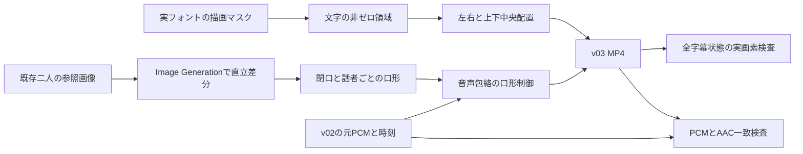
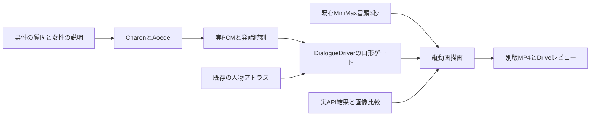
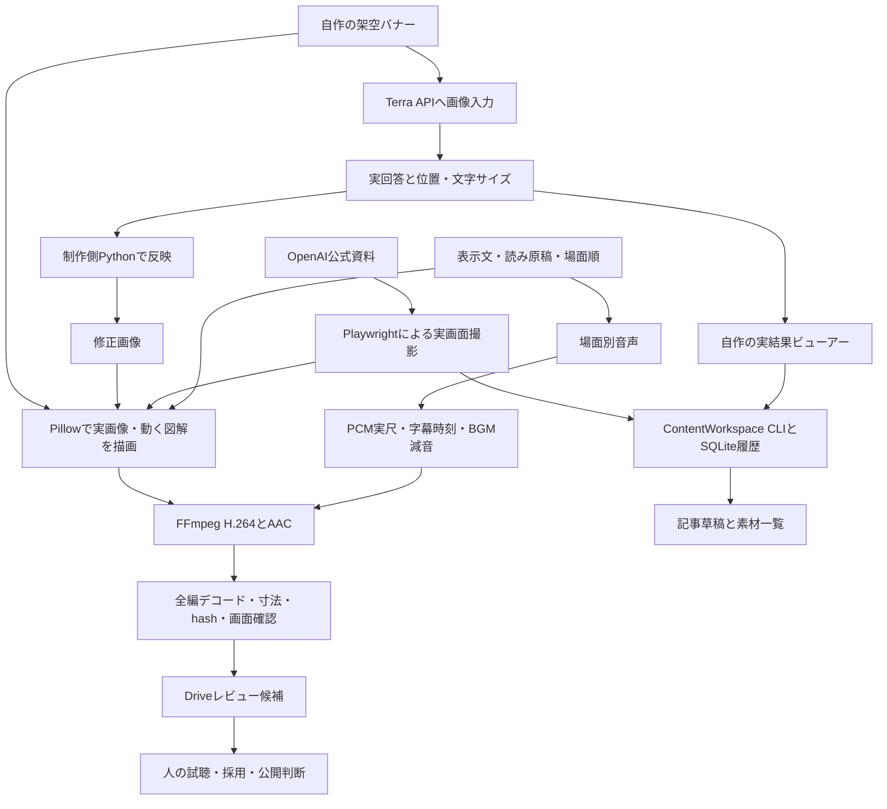

# Terraショート制作の構成図

## v03姿勢と文字配置

```mermaid
flowchart LR
  Reference[既存二人の参照画像] --> Edit[Image Generationで直立差分]
  Edit --> Atlas[閉口と話者ごとの口形]
  PCM[v02の元PCMと時刻] --> Gate[音声包絡の口形制御]
  Atlas --> Gate
  Font[実フォントの描画マスク] --> Bounds[文字の非ゼロ領域]
  Bounds --> Center[左右と上下中央配置]
  Gate --> Movie[v03 MP4]
  Center --> Movie
  Movie --> Pixels[全字幕状態の実画素検査]
  PCM --> Audio[PCMとAAC一致検査]
  Movie --> Audio
```

## v02会話版

```mermaid
flowchart LR
  Script[男性の質問と女性の説明] --> TTS[CharonとAoede]
  TTS --> PCM[実PCMと発話時刻]
  PCM --> Driver[DialogueDriverの口形ゲート]
  Atlas[既存の人物アトラス] --> Driver
  MiniMax[既存MiniMax冒頭3秒] --> Render[縦動画描画]
  Driver --> Render
  Evidence[実API結果と画像比較] --> Render
  Render --> MP4[別版MP4とDriveレビュー]
```

```mermaid
flowchart TD
  Official[OpenAI公式資料] --> Capture[Playwrightによる実画面撮影]
  Banner[自作の架空バナー] --> Vision[Terra APIへ画像入力]
  Vision --> Response[実回答と位置・文字サイズ]
  Response --> Apply[制作側Pythonで反映]
  Apply --> After[修正画像]
  Capture --> Ledger[ContentWorkspace CLIとSQLite履歴]
  Response --> Viewer[自作の実結果ビューアー]
  Viewer --> Ledger
  Story[表示文・読み原稿・場面順] --> Voice[場面別音声]
  Voice --> Audio[PCM実尺・字幕時刻・BGM減音]
  Banner --> Frames[Pillowで実画像・動く図解を描画]
  After --> Frames
  Capture --> Frames
  Story --> Frames
  Frames --> Encode[FFmpeg H.264とAAC]
  Audio --> Encode
  Encode --> Verify[全編デコード・寸法・hash・画面確認]
  Verify --> Drive[Driveレビュー候補]
  Ledger --> Article[記事草稿と素材一覧]
  Drive --> Human[人の試聴・採用・公開判断]
```

Terraへの依頼は画像確認。今回の実演ではPCの自動操作は実施していない。公式が案内するPC操作機能とは検証範囲を分ける。
