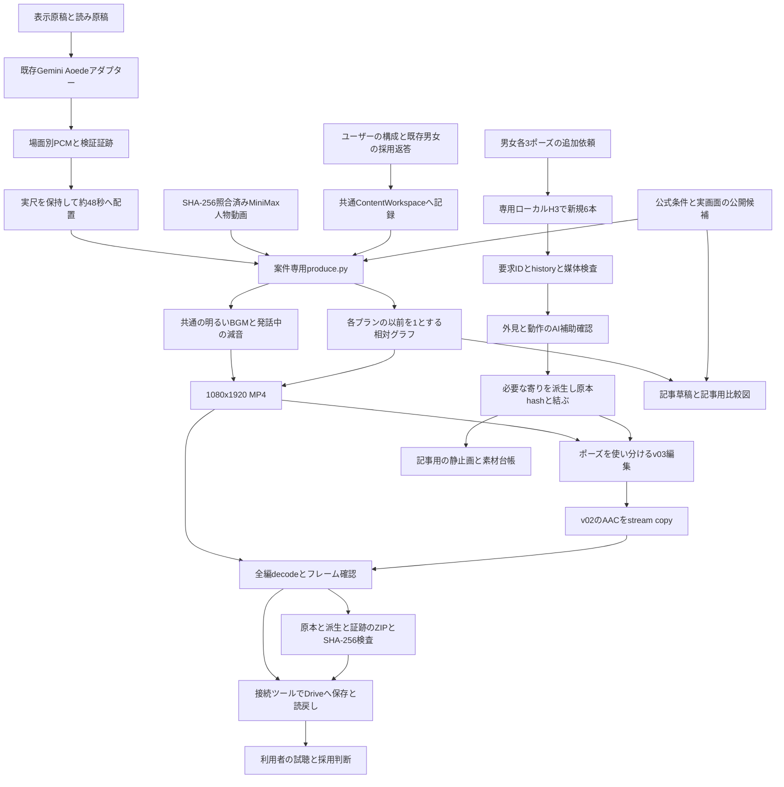

# Pro利用枠ニュースの制作経路

```mermaid
flowchart TD
    Approval[ユーザーの構成と既存男女の採用返答] --> Workspace[共通ContentWorkspaceへ記録]
    Sources[公式条件と実画面の公開候補] --> Driver[案件専用produce.py]
    Workspace --> Driver
    OldMotion[SHA-256照合済みMiniMax人物動画] --> Driver
    PoseRequest[男女各3ポーズの追加依頼] --> LocalH3[専用ローカルH3で新規6本]
    LocalH3 --> PoseProof[要求IDとhistoryと媒体検査]
    PoseProof --> PoseReview[外見と動作のAI補助確認]
    PoseReview --> SafeDerivative[必要な寄りを派生し原本hashと結ぶ]
    SafeDerivative --> Revision[ポーズを使い分けるv03編集]
    SafeDerivative --> Stills[記事用の静止画と素材台帳]
    Video --> Revision
    Revision --> AudioCopy[v02のAACをstream copy]
    AudioCopy --> QC
    QC --> Archive[原本と派生と証跡のZIPとSHA-256検査]
    Archive --> Drive
    Transcript[表示原稿と読み原稿] --> TTS[既存Gemini Aoedeアダプター]
    TTS --> PCM[場面別PCMと検証証跡]
    PCM --> Timeline[実尺を保持して約48秒へ配置]
    Timeline --> Driver
    Driver --> Chart[各プランの以前を1とする相対グラフ]
    Driver --> Mix[共通の明るいBGMと発話中の減音]
    Chart --> Video[1080x1920 MP4]
    Mix --> Video
    Video --> QC[全編decodeとフレーム確認]
    QC --> Drive[接続ツールでDriveへ保存と読戻し]
    Drive --> Human[利用者の試聴と採用判断]
    Sources --> Article[記事草稿と記事用比較図]
    Chart --> Article
```

Drive保存はYouTube・記事公開ではない。図と設計本文は独立して維持する。
