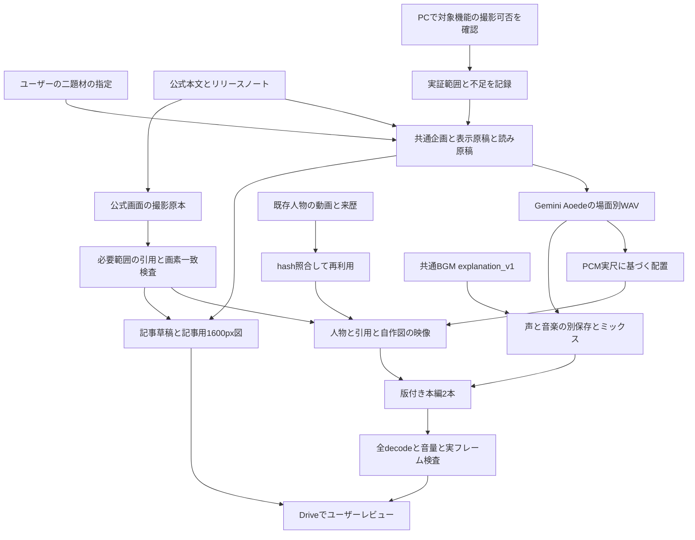

# ニュース2本の制作経路

```mermaid
flowchart TD
    Brief[ユーザーの二題材の指定] --> Plan[共通企画と表示原稿と読み原稿]
    Official[公式本文とリリースノート] --> Plan
    Computer[PCで対象機能の撮影可否を確認] --> Bound[実証範囲と不足を記録]
    Bound --> Plan
    Official --> Capture[公式画面の撮影原本]
    Capture --> Crop[必要範囲の引用と画素一致検査]
    Plan --> Voice[Gemini Aoedeの場面別WAV]
    Old[既存人物の動画と来歴] --> Hash[hash照合して再利用]
    Hash --> Render[人物と引用と自作図の映像]
    Crop --> Render
    Voice --> Timeline[PCM実尺に基づく配置]
    Timeline --> Render
    Defaults[共通BGM explanation_v1] --> Audio[声と音楽の別保存とミックス]
    Voice --> Audio
    Render --> MP4[版付き本編2本]
    Audio --> MP4
    MP4 --> QC[全decodeと音量と実フレーム検査]
    QC --> Review[Driveでユーザーレビュー]
    Crop --> Blog[記事草稿と記事用1600px図]
    Plan --> Blog
    Blog --> Review
```
