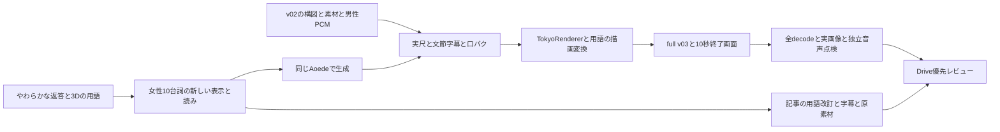
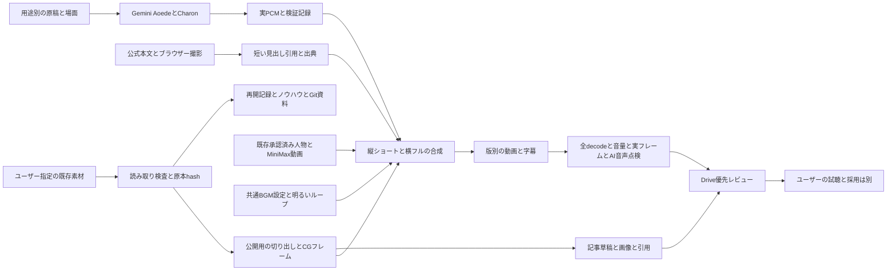

# 構成図

## full v03の会話改訂

```mermaid
flowchart LR
    Request[やわらかな返答と3Dの用語] --> Female[女性10台詞の新しい表示と読み]
    Female --> TTS[同じAoedeで生成]
    Old[v02の構図と素材と男性PCM] --> Timeline[実尺と文節字幕と口パク]
    TTS --> Timeline
    Timeline --> Render[TokyoRendererと用語の描画変換]
    Render --> Full[full v03と10秒終了画面]
    Full --> QC[全decodeと実画像と独立音声点検]
    Female --> Article[記事の用語改訂と字幕と原素材]
    QC --> Review[Drive優先レビュー]
    Article --> Review
```

```mermaid
flowchart LR
    User[ユーザー指定の既存素材] --> Inspect[読み取り検査と原本hash]
    Inspect --> Derive[公開用の切り出しとCGフレーム]
    Official[公式本文とブラウザー撮影] --> Excerpt[短い見出し引用と出典]
    Script[用途別の原稿と場面] --> TTS[Gemini AoedeとCharon]
    TTS --> PCM[実PCMと検証記録]
    Derive --> Render[縦ショートと横フルの合成]
    Excerpt --> Render
    PCM --> Render
    Duo[既存承認済み人物とMiniMax動画] --> Render
    BGM[共通BGM設定と明るいループ] --> Render
    Render --> MP4[版別の動画と字幕]
    MP4 --> QC[全decodeと音量と実フレームとAI音声点検]
    Derive --> Article[記事草稿と画像と引用]
    QC --> Review[Drive優先レビュー]
    Article --> Review
    Review --> Human[ユーザーの試聴と採用は別]
    Inspect --> History[再開記録とノウハウとGit資料]
```
