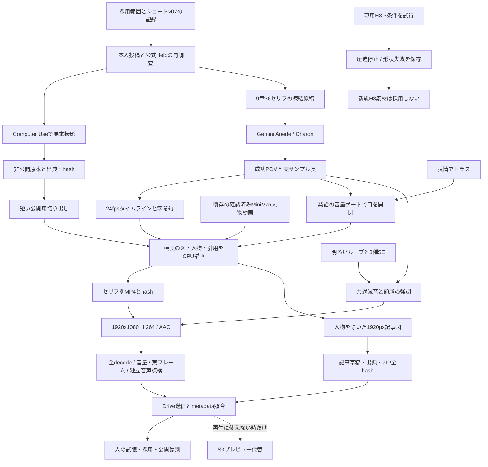

# Tiboフル動画の構成図

```mermaid
flowchart TD
  Short[採用範囲とショートv07の記録] --> Research[本人投稿と公式Helpの再調査]
  Research --> Evidence[Computer Useで原本撮影]
  Evidence --> Private[非公開原本と出典・hash]
  Private --> Public[短い公開用切り出し]
  Research --> Script[9章36セリフの凍結原稿]
  Script --> Voice[Gemini Aoede / Charon]
  Voice --> PCM[成功PCMと実サンプル長]
  PCM --> Timeline[24fpsタイムラインと字幕句]
  Existing[既存の確認済みMiniMax人物動画] --> Draw[横長の図・人物・引用をCPU描画]
  Atlas[表情アトラス] --> Mouth[発話の音量ゲートで口を開閉]
  PCM --> Mouth
  Mouth --> Draw
  Public --> Draw
  Timeline --> Draw
  H3[専用H3 3条件を試行] --> Failed[圧迫停止 / 形状失敗を保存]
  Failed --> NotUsed[新規H3素材は採用しない]
  Draw --> Segments[セリフ別MP4とhash]
  Loop[明るいループと3種SE] --> Mix[共通減音と頭尾の強調]
  PCM --> Mix
  Segments --> Full[1920x1080 H.264 / AAC]
  Mix --> Full
  Full --> QC[全decode / 音量 / 実フレーム / 独立音声点検]
  Draw --> Figures[人物を除いた1920px記事図]
  Figures --> Blog[記事草稿・出典・ZIP全hash]
  QC --> Drive[Drive送信とmetadata照合]
  Blog --> Drive
  Drive --> Mobile[人の試聴・採用・公開は別]
  Drive -. 再生に使えない時だけ .-> S3[S3プレビュー代替]
```
