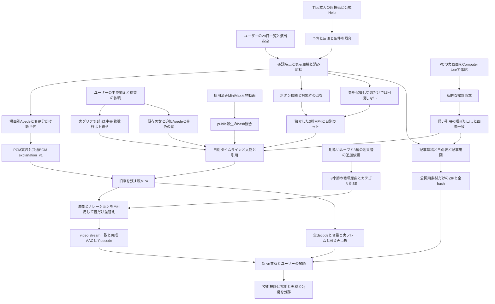

# Tiboショートの制作経路

```mermaid
flowchart TD
    Request[ユーザーの28日一覧と演出指定] --> Plan[確認時点と表示原稿と読み原稿]
    Sources[Tibo本人の原投稿と公式Help] --> Check[予告と反映と条件を照合]
    Check --> Plan
    Browser[PCの実画面をComputer Useで確認] --> Private[私的な撮影原本]
    Private --> Crop[短い引用の矩形切出しと画素一致]
    Plan --> Voice[場面別Aoedeと変更分だけ新世代]
    Feedback[ユーザーの中央揃えと称賛の依頼] --> Align[実グリフで1行は中央 複数行は上寄せ]
    Align --> Render
    Feedback --> Praise[既存男女と追加Aoedeと金色の星]
    Praise --> Render
    Existing[採用済みMiniMax人物動画] --> Hash[public派生のhash照合]
    Plan --> Reset[ボタン接触と対象枠の回復]
    Plan --> Bank[券を保管し受取だけでは回復しない]
    Reset --> Motion[独立した3秒MP4と日別カット]
    Bank --> Motion
    Hash --> Render[日別タイムラインと人物と引用]
    Motion --> Render
    Crop --> Render
    Voice --> Audio[PCM実尺と共通BGM explanation_v1]
    AudioFeedback[明るいループと3種の効果音の追加依頼] --> Loop[8小節の循環原曲とカテゴリ別SE]
    Loop --> Remix[映像とナレーションを再利用して音だけ差替え]
    MP4 --> Remix
    Remix --> StreamCheck[video stream一致と完成AACと全decode]
    StreamCheck --> Review
    Render --> MP4[旧版を残す縦MP4]
    Audio --> MP4
    MP4 --> QC[全decodeと音量と実フレームとAI音声点検]
    Plan --> Blog[記事草稿と日別表と記事用図]
    Crop --> Blog
    Blog --> ZIP[公開用素材だけのZIPと全hash]
    QC --> Review[Drive共有とユーザーの試聴]
    ZIP --> Review
    Review --> States[技術検証と採用と実機と公開を分離]
```
