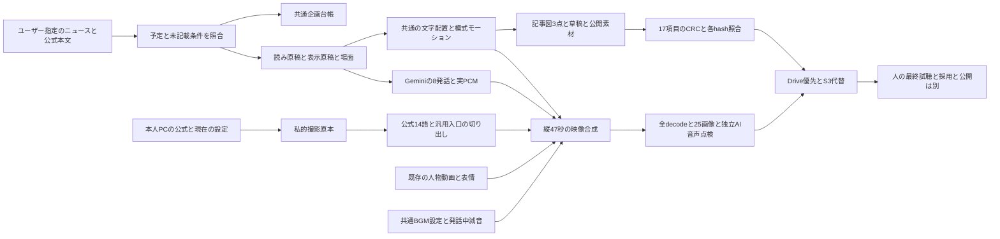

# 利用枠ニュースの制作構成図

```mermaid
flowchart LR
    News[ユーザー指定のニュースと公式本文] --> Scope[予定と未記載条件を照合]
    Browser[本人PCの公式と現在の設定] --> Raw[私的撮影原本]
    Raw --> Excerpt[公式14語と汎用入口の切り出し]
    Scope --> Script[読み原稿と表示原稿と場面]
    Script --> Voice[Geminiの8発話と実PCM]
    Script --> Diagram[共通の文字配置と模式モーション]
    Duo[既存の人物動画と表情] --> Render[縦47秒の映像合成]
    Excerpt --> Render
    Diagram --> Render
    Voice --> Render
    BGM[共通BGM設定と発話中減音] --> Render
    Render --> QC[全decodeと25画像と独立AI音声点検]
    Diagram --> Article[記事図3点と草稿と公開素材]
    Article --> ZIP[17項目のCRCと各hash照合]
    QC --> Share[Drive優先とS3代替]
    ZIP --> Share
    Share --> Human[人の最終試聴と採用と公開は別]
    Scope --> Ledger[共通企画台帳]
```
