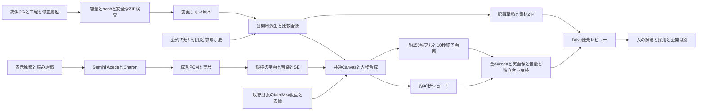

# ワインCG制作素材の再編集フロー

```mermaid
flowchart LR
  Drive[提供CGと工程と修正履歴] --> Inspect[容量とhashと安全なZIP検査]
  Inspect --> Original[変更しない原本]
  Original --> Assets[公開用派生と比較画像]
  Official[公式の短い引用と参考寸法] --> Assets
  Script[表示原稿と読み原稿] --> Voice[Gemini AoedeとCharon]
  Voice --> PCM[成功PCMと実尺]
  PCM --> Timeline[縦横の字幕と音楽とSE]
  Assets --> Render[共通Canvasと人物合成]
  Timeline --> Render
  Duo[既存男女のMiniMax動画と表情] --> Render
  Render --> Short[約30秒ショート]
  Render --> Full[約150秒フルと10秒終了画面]
  Short --> QC[全decodeと実画像と音量と独立音声点検]
  Full --> QC
  Assets --> Article[記事草稿と素材ZIP]
  QC --> Review[Drive優先レビュー]
  Article --> Review
  Review --> Human[人の試聴と採用と公開は別]
```
