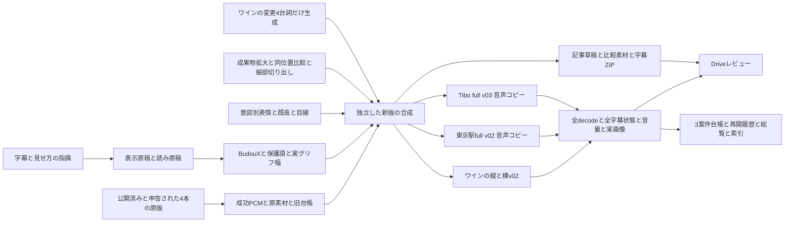

# 改訂のデータフロー

```mermaid
flowchart LR
    Old[公開済みと申告された4本の原版] --> Source[成功PCMと原素材と旧台帳]
    User[字幕と見せ方の指摘] --> Display[表示原稿と読み原稿]
    Display --> Phrase[BudouXと保護語と実グリフ幅]
    Source --> Render[独立した新版の合成]
    Phrase --> Render
    Faces[意図別表情と顔高と目線] --> Render
    Composition[成果物拡大と同位置比較と細部切り出し] --> Render
    Voice[ワインの変更4台詞だけ生成] --> Render
    Render --> Wine[ワインの縦と横v02]
    Render --> Tokyo[東京駅full v02 音声コピー]
    Render --> Tibo[Tibo full v03 音声コピー]
    Wine --> QC[全decodeと全字幕状態と音量と実画像]
    Tokyo --> QC
    Tibo --> QC
    QC --> Drive[Driveレビュー]
    Render --> Blog[記事草稿と比較素材と字幕ZIP]
    Blog --> Drive
    QC --> Records[3案件台帳と再開履歴と総覧と索引]
```
