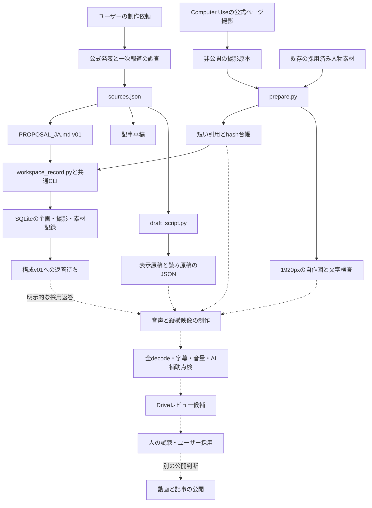

# モデル競争企画：構成図

2026-11-03。実線は実施済みの準備処理、破線は構成採用後に行う未実施工程。

```mermaid
flowchart TD
    Request[ユーザーの制作依頼] --> Research[公式発表と一次報道の調査]
    Research --> Sources[sources.json]
    Sources --> Proposal[PROPOSAL_JA.md v01]
    Sources --> Article[記事草稿]
    Sources --> Draft[draft_script.py]
    Draft --> Texts[表示原稿と読み原稿のJSON]
    CUA[Computer Useの公式ページ撮影] --> Raw[非公開の撮影原本]
    Raw --> Prepare[prepare.py]
    Approved[既存の採用済み人物素材] --> Prepare
    Prepare --> Excerpts[短い引用とhash台帳]
    Prepare --> Figures[1920pxの自作図と文字検査]
    Proposal --> CLI[workspace_record.pyと共通CLI]
    Excerpts --> CLI
    CLI --> DB[SQLiteの企画・撮影・素材記録]
    DB --> Pending[構成v01への返答待ち]
    Pending -.明示的な採用返答.-> Production[音声と縦横映像の制作]
    Texts -.-> Production
    Excerpts -.-> Production
    Figures -.-> Production
    Production -.-> QC[全decode・字幕・音量・AI補助点検]
    QC -.-> Drive[Driveレビュー候補]
    Drive -.-> Human[人の試聴・ユーザー採用]
    Human -.別の公開判断.-> Publication[動画と記事の公開]
```

映像本体や撮影原本はGitへ含めない。DBへの保存と構成採用、技術確認と人の採用、アップロードと実機再生は別状態。
