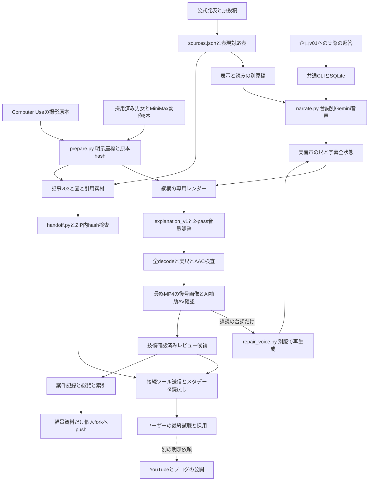

# モデル競争動画のアーキテクチャ図

2026-11-03。本文は[ARCHITECTURE.md](ARCHITECTURE.md)。接続ツールによる共有と人の採用は、ローカルレンダーから独立した工程。

```mermaid
flowchart TD
  Official[公式発表と原投稿] --> Sources[sources.jsonと表現対応表]
  Capture[Computer Useの撮影原本] --> Prepare[prepare.py 明示座標と原本hash]
  Existing[採用済み男女とMiniMax動作6本] --> Prepare
  User[企画v01への実際の返答] --> CLI[共通CLIとSQLite]
  Sources --> Script[表示と読みの別原稿]
  CLI --> TTS[narrate.py 台詞別Gemini音声]
  Script --> TTS
  TTS --> Timeline[実音声の尺と字幕全状態]
  Prepare --> Render[縦横の専用レンダー]
  Timeline --> Render
  Render --> Mix[explanation_v1と2-pass音量調整]
  Mix --> MP4[全decodeと実尺とAAC検査]
  MP4 --> Review[最終MP4の復号画像とAI補助AV確認]
  Review -->|誤読の台詞だけ| Repair[repair_voice.py 別版で再生成]
  Repair --> Timeline
  Review --> Candidate[技術確認済みレビュー候補]
  Sources --> Article[記事v03と図と引用素材]
  Prepare --> Article
  Article --> Kit[handoff.pyとZIP内hash検査]
  Candidate --> Drive[接続ツール送信とメタデータ読戻し]
  Kit --> Drive
  Drive --> Human[ユーザーの最終試聴と採用]
  Candidate --> Record[案件記録と総覧と索引]
  Record --> Fork[軽量資料だけ個人forkへpush]
  Human -. 別の明示依頼 .-> Publish[YouTubeとブログの公開]
```

原本、API応答、動画、音声、ZIPと私的なDrive受領はoutputsに保存し、Gitへ含めない。AI補助確認は人の最終試聴を置き換えない。
