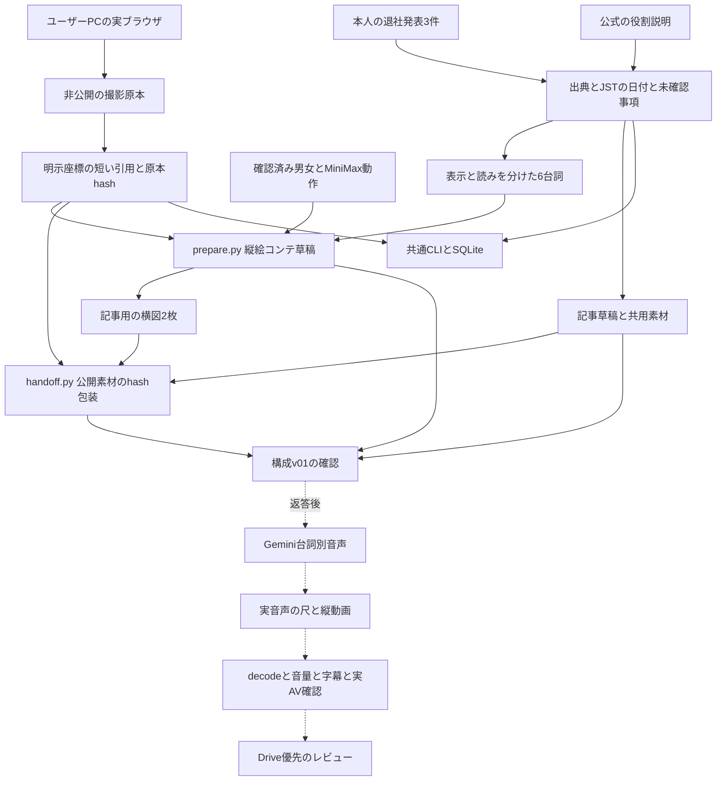

# 退社発表ショート準備のアーキテクチャ図

2026-11-04。本文は[ARCHITECTURE.md](ARCHITECTURE.md)。点線は構成確認後の予定工程。

```mermaid
flowchart TD
  Posts[本人の退社発表3件] --> Sources[出典とJSTの日付と未確認事項]
  Official[公式の役割説明] --> Sources
  Browser[ユーザーPCの実ブラウザ] --> Raw[非公開の撮影原本]
  Raw --> Crop[明示座標の短い引用と原本hash]
  Prior[確認済み男女とMiniMax動作] --> Prepare[prepare.py 縦絵コンテ草稿]
  Crop --> Prepare
  Sources --> Script[表示と読みを分けた6台詞]
  Script --> Prepare
  Sources --> Article[記事草稿と共用素材]
  Prepare --> Figures[記事用の横図2枚]
  Crop --> Package[handoff.py 公開素材のhash包装]
  Figures --> Package
  Article --> Package
  Sources --> CLI[共通CLIとSQLite]
  Crop --> CLI
  Prepare --> Review[構成v01の確認]
  Review -. 返答後 .-> Voice[Gemini台詞別音声]
  Voice -.-> Render[実音声の尺と縦動画]
  Render -.-> QC[decodeと音量と字幕と実AV確認]
  QC -.-> Share[Drive優先のレビュー]
  Article --> Review
  Package --> Review
```

確認前の依頼を、構成の採用や公開許可へ読み替えない。技術検査、AI補助、人の試聴、完成品採用、公開は別の記録として残す。
