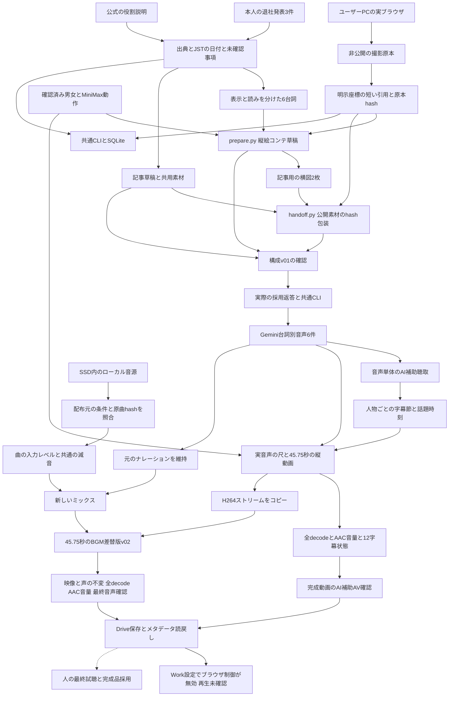

# 退社発表ショートのアーキテクチャ図

2026-11-04。本文は[ARCHITECTURE.md](ARCHITECTURE.md)。点線は未実施の人による最終確認。

```mermaid
flowchart TD
  Posts[本人の退社発表3件] --> Sources[出典とJSTの日付と未確認事項]
  Official[公式の役割説明] --> Sources
  Browser[ユーザーPCの実ブラウザ] --> Raw[非公開の撮影原本]
  Raw --> Crop[明示座標の短い引用と原本hash]
  Prior[確認済み男女とMiniMax動作] --> Prepare[prepare.py 縦絵コンテ草稿]
  Crop --> Prepare
  Sources --> Script[表示と読みを分けた6台詞]
  Script --> Prepare
  Sources --> Article[記事草稿と共用素材]
  Prepare --> Figures[記事用の横図2枚]
  Crop --> Package[handoff.py 公開素材のhash包装]
  Figures --> Package
  Article --> Package
  Sources --> CLI[共通CLIとSQLite]
  Crop --> CLI
  Prepare --> Review[構成v01の確認]
  Review --> Accept[実際の採用返答と共通CLI]
  Accept --> Voice[Gemini台詞別音声6件]
  Voice --> Listen[音声単体のAI補助聴取]
  Listen --> Timing[人物ごとの字幕節と話題時刻]
  Voice --> Render[実音声の尺と45.75秒の縦動画]
  Timing --> Render
  Prior --> Render
  Render --> QC[全decodeとAAC音量と12字幕状態]
  QC --> AV[完成動画のAI補助AV確認]
  AV --> Share[Drive保存とメタデータ読戻し]
  Share --> Limited[Work設定でブラウザ制御が無効 再生未確認]
  Share -.-> Human[人の最終試聴と完成品採用]
  Article --> Review
  Package --> Review
  LocalMusic[SSD内のローカル音源] --> License[配布元の条件と原曲hashを照合]
  License --> MusicLevel[曲の入力レベルと共通の減音]
  Voice --> KeepVoice[元のナレーションを維持]
  KeepVoice --> Remix[新しいミックス]
  MusicLevel --> Remix
  Render --> KeepVideo[H264ストリームをコピー]
  KeepVideo --> V02[45.75秒のBGM差替版v02]
  Remix --> V02
  V02 --> BgmQC[映像と声の不変 全decode AAC音量 最終音声確認]
  BgmQC --> Share
```

記事v02の包装は15ペイロードとhash manifest。動画と記事の保存を、人の試聴や完成品採用・公開の証明へ読み替えない。
