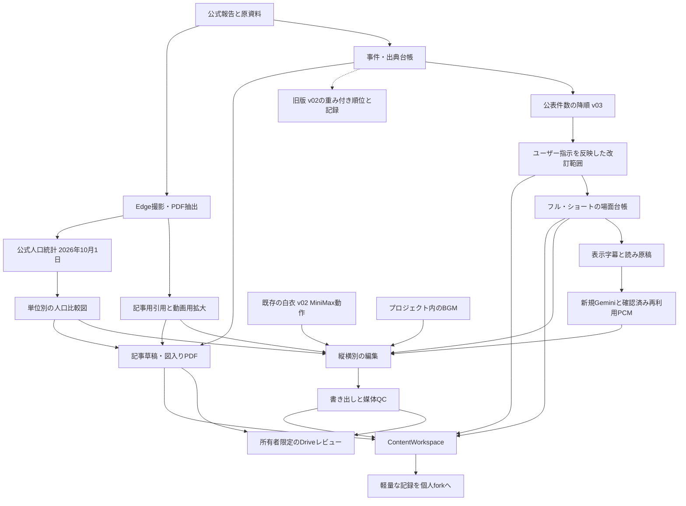

# 国内情報漏えい解説の制作構成図

```mermaid
flowchart TD
    A["公式報告と原資料"] --> B["事件・出典台帳"]
    B --> C["公表件数の降順 v03"]
    C --> D["ユーザー指示を反映した改訂範囲"]
    B -.-> V["旧版 v02の重み付き順位と記録"]
    D --> E["フル・ショートの場面台帳"]
    A --> F["Edge撮影・PDF抽出"]
    F --> G["記事用引用と動画用拡大"]
    F --> R["公式人口統計 2026年10月1日"]
    R --> S["単位別の人口比較図"]
    S --> J
    S --> N
    E --> H["表示字幕と読み原稿"]
    H --> I["新規Geminiと確認済み再利用PCM"]
    E --> J["縦横別の編集"]
    G --> J
    K["既存の白衣 v02 MiniMax動作"] --> J
    I --> J
    L["プロジェクト内のBGM"] --> J
    J --> M["書き出しと媒体QC"]
    B --> N["記事草稿・図入りPDF"]
    G --> N
    M --> O["所有者限定のDriveレビュー"]
    N --> O
    D --> P["ContentWorkspace"]
    E --> P
    M --> P
    N --> P
    P --> Q["軽量な記録を個人forkへ"]
```

設計本文は[制作構成](ARCHITECTURE.md)。採用・検査・公開の境界は[案件記録](RESUME_AND_KNOWHOW_JA.md)を参照する。
