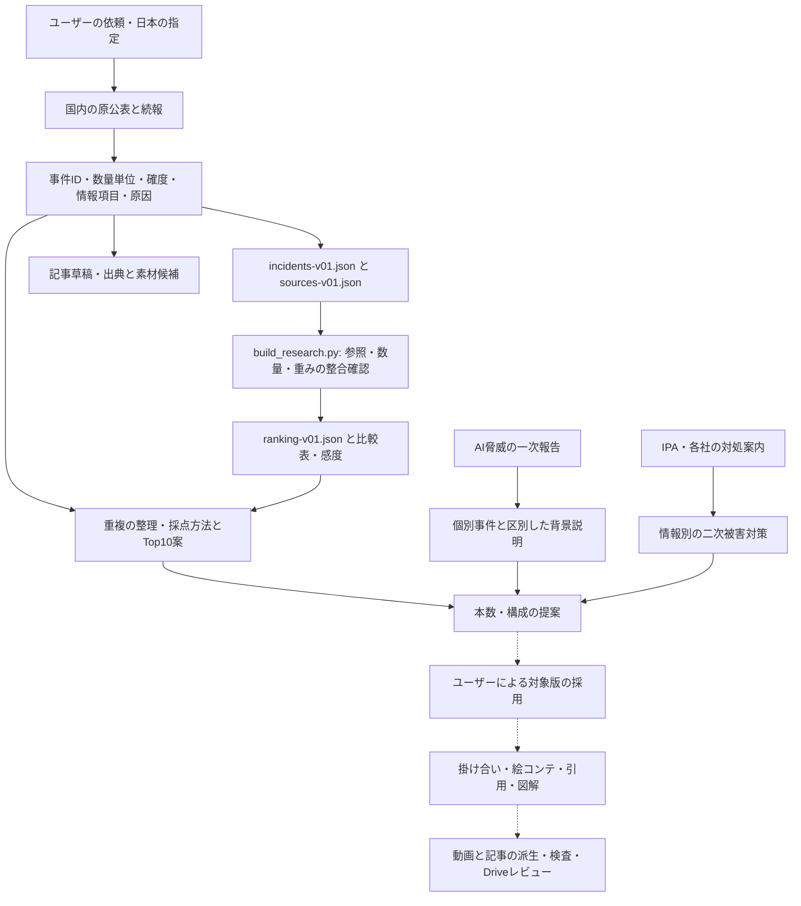

# 国内情報漏えい解説の制作フロー

2026-11-07。本文は[構成](ARCHITECTURE.md)。実線は現在の調査・記録、破線は採用後に進める工程。

```mermaid
flowchart TD
    A[ユーザーの依頼・日本の指定] --> B[国内の原公表と続報]
    B --> C[事件ID・数量単位・確度・情報項目・原因]
    C --> D[重複の整理・採点方法とTop10案]
    C --> X[incidents-v01.json と sources-v01.json]
    X --> Y[build_research.py: 参照・数量・重みの整合確認]
    Y --> Z[ranking-v01.json と比較表・感度]
    Z --> D
    E[AI脅威の一次報告] --> F[個別事件と区別した背景説明]
    G[IPA・各社の対処案内] --> H[情報別の二次被害対策]
    D --> I[本数・構成の提案]
    F --> I
    H --> I
    C --> J[記事草稿・出典と素材候補]
    I -.-> K[ユーザーによる対象版の採用]
    K -.-> L[掛け合い・絵コンテ・引用・図解]
    L -.-> M[動画と記事の派生・検査・Driveレビュー]
```

本番の人物・音声生成や公開まで自動実行するシステムを追加した図ではない。
