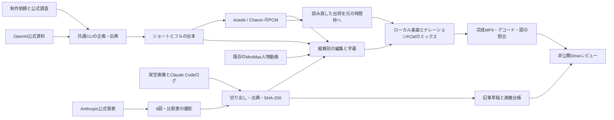

# Fable 5.2解説動画のアーキテクチャ図

```mermaid
flowchart LR
    U["制作依頼と公式調査"] --> P["共通CLIの企画・出典"]
    H["Anthropic公式発表"] --> C["9図・比較表の撮影"]
    O["OpenAI公式資料"] --> P
    C --> A["切り出し・出典・SHA-256"]
    D["架空画像とClaude Codeログ"] --> A
    P --> S["ショートとフルの台本"]
    S --> V["Aoede / Charon のPCM"]
    S --> R["縦横別の編集と字幕"]
    A --> R
    M["既存のMiniMax人物動画"] --> R
    V --> R
    R --> X["ローカル楽曲とナレーションPCMのミックス"]
    V --> F["読み直した台詞を元の時間枠へ"]
    F --> X
    X --> Q["完成MP4・デコード・図の照合"]
    A --> B["記事草稿と画像台帳"]
    Q --> G["非公開Driveレビュー"]
    B --> G
```
