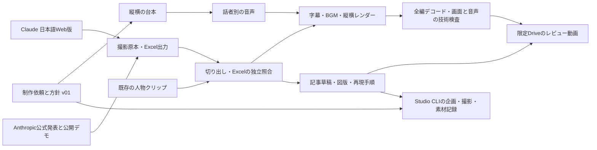

# 制作アーキテクチャ図

```mermaid
flowchart LR
  Request["制作依頼と方針 v01"] --> Story["縦横の台本"]
  Claude["Claude 日本語Web版"] --> Original["撮影原本・Excel出力"]
  Official["Anthropic公式発表と公開デモ"] --> Original
  Original --> Prep["切り出し・Excelの独立照合"]
  Motion["既存の人物クリップ"] --> Prep
  Story --> Voice["話者別の音声"]
  Voice --> Render["字幕・BGM・縦横レンダー"]
  Prep --> Render
  Prep --> Article["記事草稿・図版・再現手順"]
  Render --> QC["全編デコード・画面と音声の技術検査"]
  QC --> Drive["限定Driveのレビュー動画"]
  Article --> Drive
  Request --> Studio["Studio CLIの企画・撮影・素材記録"]
  Article --> Studio
```
