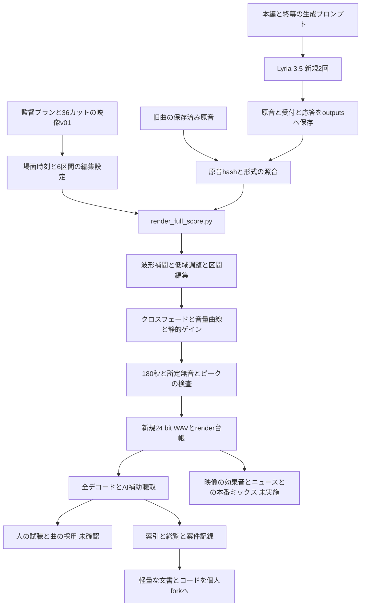

# 「灰の街」の制作構成図

```mermaid
flowchart TD
    Plan[監督プランと36カットの映像v01] --> Cues[場面時刻と6区間の編集設定]
    Old[旧曲の保存済み原音] --> Hash[原音hashと形式の照合]
    Prompt[本編と終幕の生成プロンプト] --> Lyria[Lyria 3.5 新規2回]
    Lyria --> Raw[原音と受付と応答をoutputsへ保存]
    Raw --> Hash
    Cues --> Render[render_full_score.py]
    Hash --> Render
    Render --> PCM[波形補間と低域調整と区間編集]
    PCM --> Gain[クロスフェードと音量曲線と静的ゲイン]
    Gain --> Check[180秒と所定無音とピークの検査]
    Check --> WAV[新規24 bit WAVとrender台帳]
    WAV --> Review[全デコードとAI補助聴取]
    Review --> User[人の試聴と曲の採用 未確認]
    WAV --> Mix[映像の効果音とニュースとの本番ミックス 未実施]
    Review --> Docs[索引と総覧と案件記録]
    Docs --> Fork[軽量な文書とコードを個人forkへ]
```

設計本文は [ARCHITECTURE.md](ARCHITECTURE.md)。媒体とprivate応答はGitへ含めない。保存済み原音からの再出力はAPIを呼ばない。
