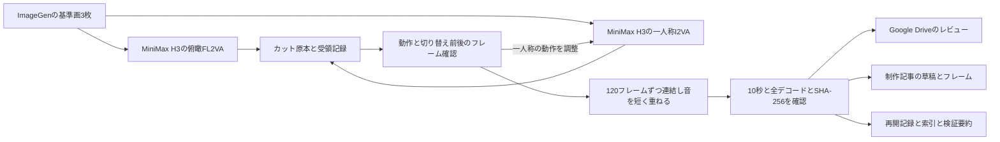

# 屋上パルクール映像テストの構成図

```mermaid
flowchart LR
    Frames[ImageGenの基準画3枚] --> Aerial[MiniMax H3の俯瞰FL2VA]
    Frames --> POV[MiniMax H3の一人称I2VA]
    Aerial --> Inputs[カット原本と受領記録]
    POV --> Inputs
    Inputs --> Inspect[動作と切り替え前後のフレーム確認]
    Inspect -->|一人称の動作を調整| POV
    Inspect --> Edit[120フレームずつ連結し音を短く重ねる]
    Edit --> QC[10秒と全デコードとSHA-256を確認]
    QC --> Review[Google Driveのレビュー]
    QC --> Article[制作記事の草稿とフレーム]
    QC --> Record[再開記録と索引と検証要約]
```

処理の詳細は[設計本文](ARCHITECTURE.md)を参照する。
