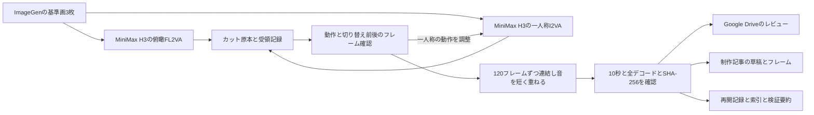
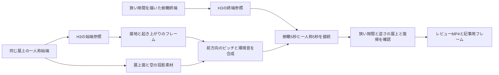
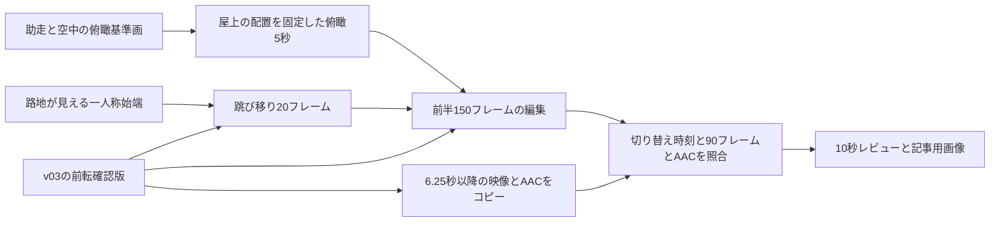

# 屋上パルクール映像テストの構成図

```mermaid
flowchart LR
    Frames[ImageGenの基準画3枚] --> Aerial[MiniMax H3の俯瞰FL2VA]
    Frames --> POV[MiniMax H3の一人称I2VA]
    Aerial --> Inputs[カット原本と受領記録]
    POV --> Inputs
    Inputs --> Inspect[動作と切り替え前後のフレーム確認]
    Inspect -->|一人称の動作を調整| POV
    Inspect --> Edit[120フレームずつ連結し音を短く重ねる]
    Edit --> QC[10秒と全デコードとSHA-256を確認]
    QC --> Review[Google Driveのレビュー]
    QC --> Article[制作記事の草稿とフレーム]
    QC --> Record[再開記録と索引と検証要約]
```

処理の詳細は[設計本文](ARCHITECTURE.md)を参照する。

## 狭い屋上と前転の改訂

```mermaid
flowchart LR
    Air[狭い隙間を描いた俯瞰終端] --> L2VA[H3の終端参照]
    P0[同じ屋上の一人称始端] --> I2VA[H3の始端参照]
    P0 --> Texture[屋上面と空の投影素材]
    I2VA --> Anchors[接地と起き上がりのフレーム]
    Anchors --> Roll[前方向のピッチと環境音を合成]
    Texture --> Roll
    L2VA --> Join[俯瞰5秒と一人称5秒を接続]
    Roll --> Join
    Join --> Check[狭い隙間と逆さの屋上と復帰を確認]
    Check --> Output[レビューMP4と記事用フレーム]
```

## 二棟の分離と前転の継承

```mermaid
flowchart LR
    Anchors[助走と空中の俯瞰基準画] --> Aerial[屋上の配置を固定した俯瞰5秒]
    Entry[路地が見える一人称始端] --> Cross[跳び移り20フレーム]
    V03[v03の前転確認版] --> Cross
    Aerial --> Prefix[前半150フレームの編集]
    Cross --> Prefix
    V03 --> Prefix
    V03 --> Keep[6.25秒以降の映像とAACをコピー]
    Prefix --> CheckV04[切り替え時刻と90フレームとAACを照合]
    Keep --> CheckV04
    CheckV04 --> ReviewV04[10秒レビューと記事用画像]
```
