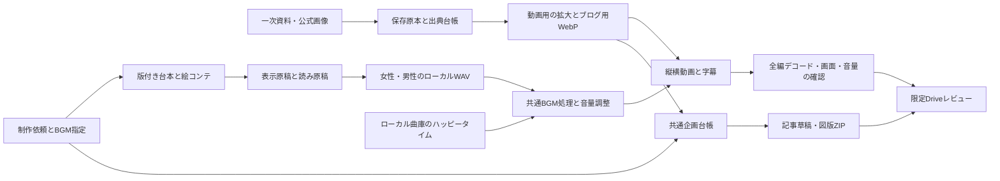

# 制作アーキテクチャ図

```mermaid
flowchart LR
    Official["一次資料・公式画像"] --> Originals["保存原本と出典台帳"]
    Originals --> Figures["動画用の拡大とブログ用WebP"]
    Request["制作依頼とBGM指定"] --> Story["版付き台本と絵コンテ"]
    Story --> Script["表示原稿と読み原稿"]
    Script --> Speech["女性・男性のローカルWAV"]
    Music["ローカル曲庫のハッピータイム"] --> Mix["共通BGM処理と音量調整"]
    Speech --> Mix
    Figures --> Render["縦横動画と字幕"]
    Mix --> Render
    Render --> QC["全編デコード・画面・音量の確認"]
    Request --> Studio["共通企画台帳"]
    Figures --> Studio
    Studio --> Article["記事草稿・図版ZIP"]
    QC --> Drive["限定Driveレビュー"]
    Article --> Drive
```
