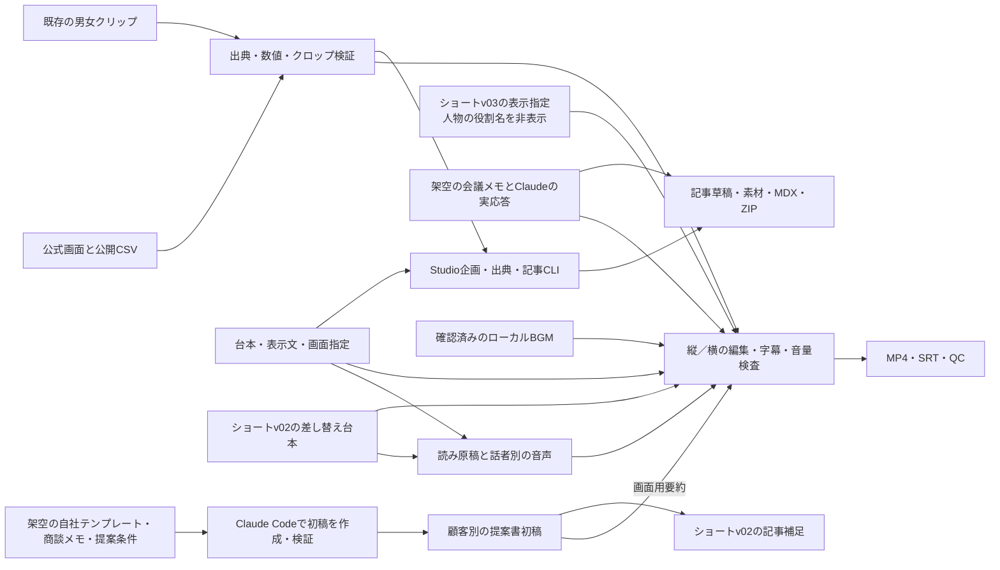

# 日本のClaude利用｜アーキテクチャ図

```mermaid
flowchart LR
    Sources["公式画面と公開CSV"] --> Prepare["出典・数値・クロップ検証"]
    Legacy["既存の男女クリップ"] --> Prepare
    Story["台本・表示文・画面指定"] --> Voice["読み原稿と話者別の音声"]
    RevisedStory["ショートv02の差し替え台本"] --> Voice
    RevisedStory --> Render
    ShortV03["ショートv03の表示指定<br/>人物の役割名を非表示"] --> Render
    Story --> Render["縦／横の編集・字幕・音量検査"]
    Demo["架空の会議メモとClaudeの実応答"] --> Render
    ProposalInputs["架空の自社テンプレート・商談メモ・提案条件"] --> Agent["Claude Codeで初稿を作成・検証"]
    Agent --> Draft["顧客別の提案書初稿"]
    Draft -->|画面用要約| Render
    Voice --> Render
    Prepare --> Render
    Music["確認済みのローカルBGM"] --> Render
    Render --> Video["MP4・SRT・QC"]
    Prepare --> Studio["Studio企画・出典・記事CLI"]
    Story --> Studio
    Studio --> Article["記事草稿・素材・MDX・ZIP"]
    Demo --> Article
    Draft --> ArticleSupplement["ショートv02の記事補足"]
```
