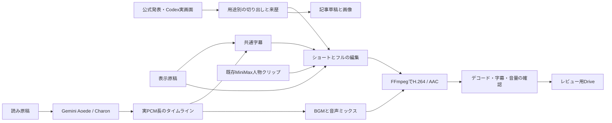

# GPT-6.2 AstraとSolの制作フロー

```mermaid
flowchart LR
    Sources["公式発表・Codex実画面"] --> Figures["用途別の切り出しと来歴"]
    Figures --> Edit["ショートとフルの編集"]
    Figures --> Blog["記事草稿と画像"]
    Story["表示原稿"] --> Captions["共通字幕"]
    Story --> Edit
    Reading["読み原稿"] --> TTS["Gemini Aoede / Charon"]
    TTS --> Timing["実PCM長のタイムライン"]
    Timing --> Captions
    Timing --> Audio["BGMと音声ミックス"]
    Existing["既存MiniMax人物クリップ"] --> Edit
    Captions --> Edit
    Audio --> Export["FFmpegでH.264 / AAC"]
    Edit --> Export
    Export --> QC["デコード・字幕・音量の確認"]
    QC --> Drive["レビュー用Drive"]
```

[制作構成と実行手順](ARCHITECTURE.md)
