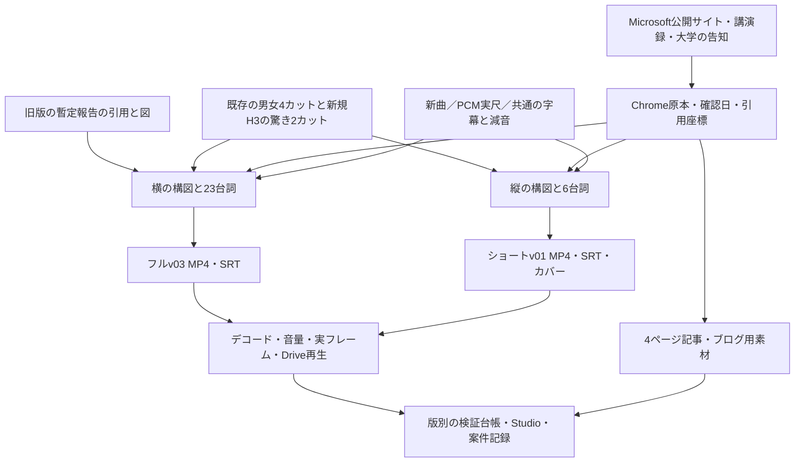
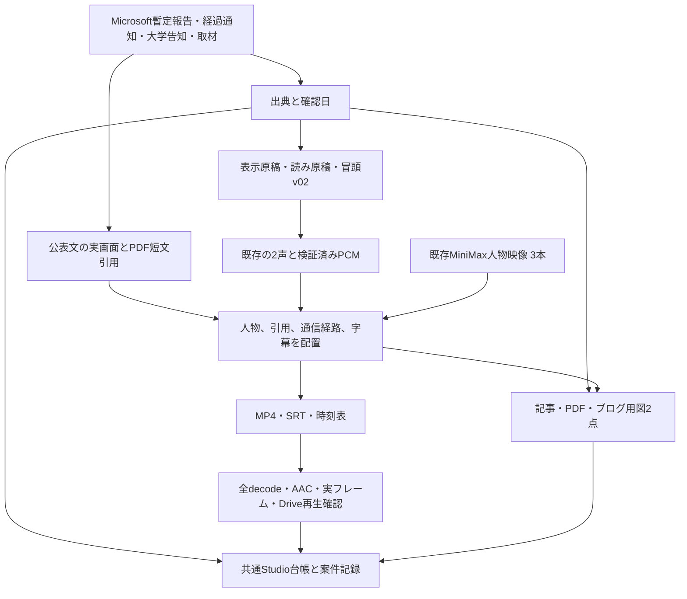

# 公式資料からレビュー動画まで

## フルv03とショートv01

```mermaid
flowchart TD
    official["Microsoft公開サイト・講演録・大学の告知"] --> capture["Chrome原本・確認日・引用座標"]
    captures["旧版の暫定報告の引用と図"] --> landscape["横の構図と23台詞"]
    cast["既存の男女4カットと新規H3の驚き2カット"] --> landscape
    cast --> portrait["縦の構図と6台詞"]
    capture --> landscape
    capture --> portrait
    score["新曲／PCM実尺／共通の字幕と減音"] --> landscape
    score --> portrait
    landscape --> full["フルv03 MP4・SRT"]
    portrait --> short["ショートv01 MP4・SRT・カバー"]
    capture --> article["4ページ記事・ブログ用素材"]
    full --> verify["デコード・音量・実フレーム・Drive再生"]
    short --> verify
    verify --> log["版別の検証台帳・Studio・案件記録"]
    article --> log
```

## フルv01・v02

```mermaid
flowchart TD
  S["Microsoft暫定報告・経過通知・大学告知・取材"] --> R["出典と確認日"]
  S --> C["公表文の実画面とPDF短文引用"]
  R --> T["表示原稿・読み原稿・冒頭v02"]
  T --> V["既存の2声と検証済みPCM"]
  C --> E["人物、引用、通信経路、字幕を配置"]
  V --> E
  H["既存MiniMax人物映像 3本"] --> E
  E --> M["MP4・SRT・時刻表"]
  M --> Q["全decode・AAC・実フレーム・Drive再生確認"]
  R --> A["記事・PDF・ブログ用図2点"]
  E --> A
  R --> L["共通Studio台帳と案件記録"]
  Q --> L
  A --> L
```
