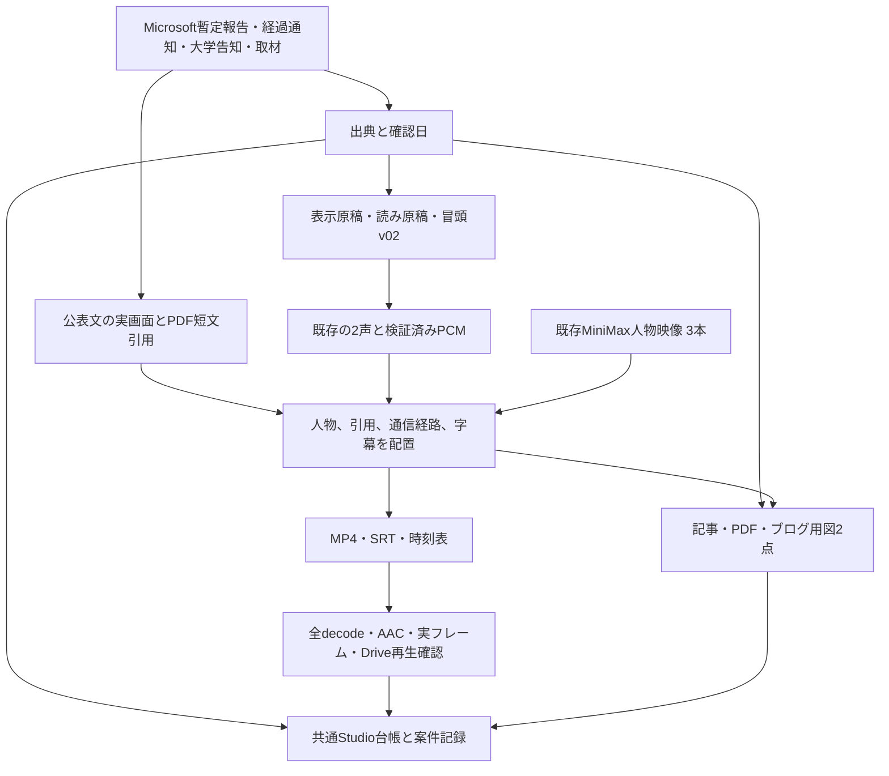

# 公式資料からレビュー動画まで

```mermaid
flowchart TD
  S["Microsoft暫定報告・経過通知・大学告知・取材"] --> R["出典と確認日"]
  S --> C["公表文の実画面とPDF短文引用"]
  R --> T["表示原稿・読み原稿・冒頭v02"]
  T --> V["既存の2声と検証済みPCM"]
  C --> E["人物、引用、通信経路、字幕を配置"]
  V --> E
  H["既存MiniMax人物映像 3本"] --> E
  E --> M["MP4・SRT・時刻表"]
  M --> Q["全decode・AAC・実フレーム・Drive再生確認"]
  R --> A["記事・PDF・ブログ用図2点"]
  E --> A
  R --> L["共通Studio台帳と案件記録"]
  Q --> L
  A --> L
```
