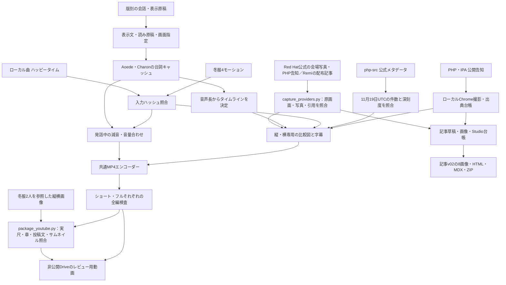

# PHP比較解説のデータフロー

```mermaid
flowchart TD
    PHP["PHP・IPA 公開告知"] --> C["ローカルChrome撮影・出典台帳"]
    A["php-src 公式メタデータ"] --> R["11月19日UTCの件数と深刻度を照合"]
    C --> L["縦・横専用の比較図と字幕"]
    R --> L
    W["冬服4モーション"] --> I["入力ハッシュ照合"]
    M["ローカル曲 ハッピータイム"] --> I
    I --> L
    S["表示文・読み原稿・画面指定"] --> V["Aoede・Charonの台詞キャッシュ"]
    V --> T["音声長からタイムラインを決定"]
    T --> L
    L --> E["共通MP4エンコーダー"]
    I --> B["発話中の減音・音量合わせ"]
    V --> B
    B --> E
    E --> Q["ショート・フルそれぞれの全編検査"]
    Q --> D["非公開Driveのレビュー用動画"]
    C --> H["記事草稿・画像・Studio台帳"]
    Z["Red Hat公式の会場写真・PHP告知／Remiの配布記事"] --> X["capture_providers.py：原画面・写真・引用を照合"]
    X --> L
    X --> H
    S2["版別の会話・表示原稿"] --> S
    Q --> Y["package_youtube.py：実尺・章・投稿文・サムネイル照合"]
    A2["冬服2人を参照した縦横画像"] --> Y
    Y --> D
    H --> J["記事v02の8画像・HTML・MDX・ZIP"]
```
