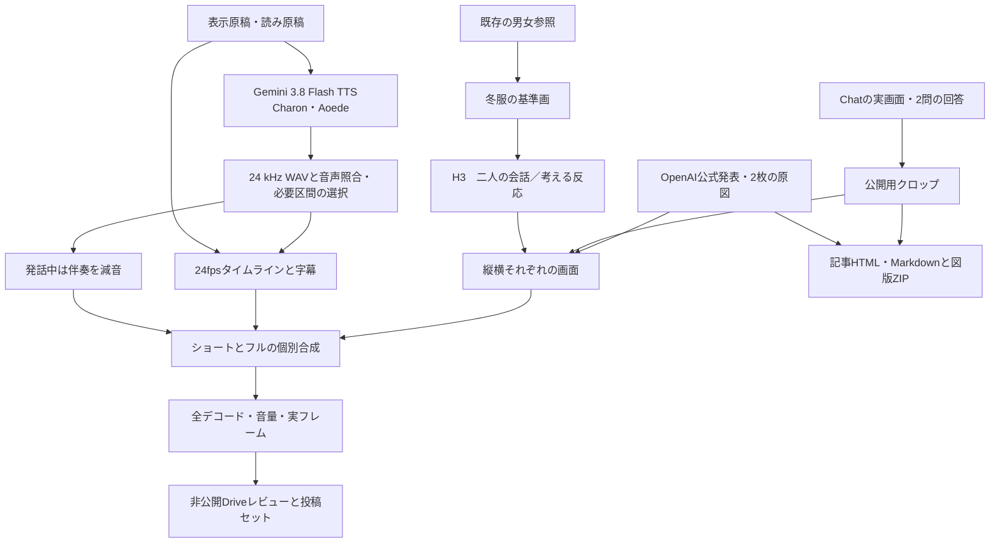

# GPT-6.2冬服編の制作経路

```mermaid
flowchart TD
    A["Chatの実画面・2問の回答"] --> B["公開用クロップ"]
    C["OpenAI公式発表・2枚の原図"] --> D["縦横それぞれの画面"]
    B --> D
    E["既存の男女参照"] --> F["冬服の基準画"]
    F --> G["H3　二人の会話／考える反応"]
    G --> D
    H["表示原稿・読み原稿"] --> I["Gemini 3.8 Flash TTS　Charon・Aoede"]
    I --> J["24 kHz WAVと音声照合・必要区間の選択"]
    J --> K["24fpsタイムラインと字幕"]
    H --> K
    D --> L["ショートとフルの個別合成"]
    K --> L
    J --> M["発話中は伴奏を減音"]
    M --> L
    L --> N["全デコード・音量・実フレーム"]
    N --> O["非公開Driveレビューと投稿セット"]
    B --> P["記事HTML・Markdownと図版ZIP"]
    C --> P
```
