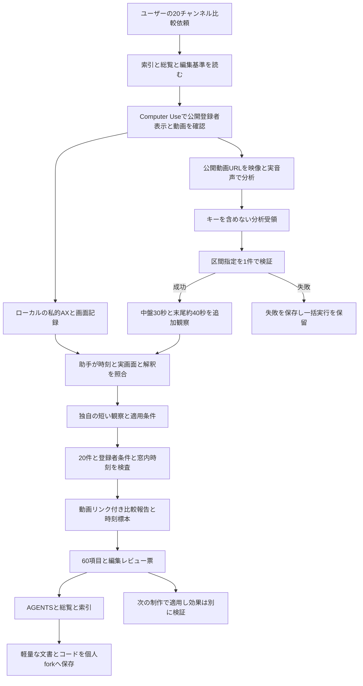

# 20チャンネル比較調査のMermaid図

更新日：2026-11-03。[設計本文](ARCHITECTURE.md)から独立して維持する。

```mermaid
flowchart TD
    Request[ユーザーの20チャンネル比較依頼] --> Entry[索引と総覧と編集基準を読む]
    Entry --> Browser[Computer Useで公開登録者表示と動画を確認]
    Browser --> Local[ローカルの私的AXと画面記録]
    Browser --> Whole[公開動画URLを映像と実音声で分析]
    Whole --> Receipt[キーを含めない分析受領]
    Receipt --> Pilot[区間指定を1件で検証]
    Pilot -->|成功| Focus[中盤30秒と末尾約40秒を追加観察]
    Pilot -->|失敗| Error[失敗を保存し一括実行を保留]
    Focus --> Review[助手が時刻と実画面と解釈を照合]
    Local --> Review
    Review --> Curated[独自の短い観察と適用条件]
    Curated --> Validate[20件と登録者条件と窓内時刻を検査]
    Validate --> Report[動画リンク付き比較報告と時刻標本]
    Report --> Playbook[60項目と編集レビュー票]
    Playbook --> Index[AGENTSと総覧と索引]
    Index --> Fork[軽量な文書とコードを個人forkへ保存]
    Playbook --> Next[次の制作で適用し効果は別に検証]
```

API生応答・失敗受領・私的原本はignoredの`outputs/`。動画の再配布、Studioの自動カット機能、媒体公開、mainマージはこの経路に含まない。
